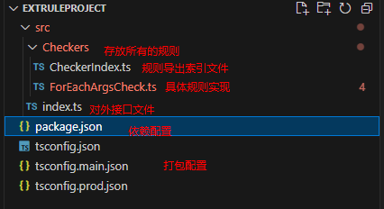
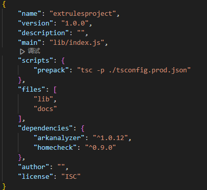
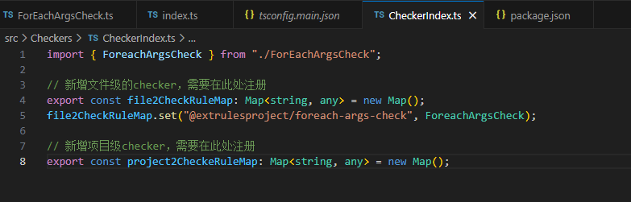
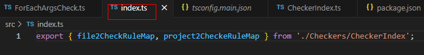
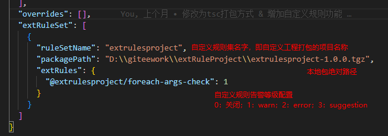
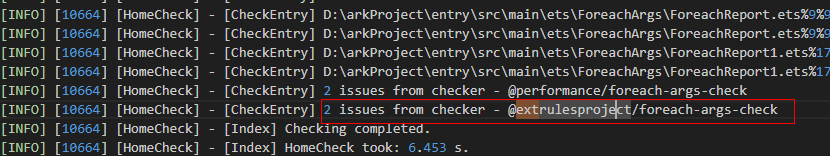

# 自定义规则开发指南
## 一、什么是自定义规则？
自定义规则是指用户根据自身需求，基于homeCheck定制开发自己的代码检查规则。

## 二、如何开发自定义规则？
### 1、使用demo工程进行开发
demo工程下载地址：[extRuleProject.zip](../../extRuleProject/extRuleProject.zip)  
工程目录结构如下：  

### 2、需要依赖homecheck和arkanalyzer两个包：

### 3、编写自定义规则
（1）src/Checker/xxxxxCheck.ts：具体规则类的开发参考[规则开发指南](./规则开发指南.md)
（2）src/Checker/checkerIndex.ts：中需要配置自定义规则所属的类别，即设置到对应的map中，file2CheckRuleMap存放不跨文件遍历的规则，project2CheckRuleMap存放自定义遍历方式的规则;  
  
（3）src/index.ts：对外接口文件，需要导出上述两个map；  

### 4、打包
使用tsc工具，命令行执行npm pack，产物为homecheck-x.x.x.tgz文件。  

## 三、如何使用自定义规则？
1、提前安装好homecheck工程；  
2、ruleConfig.json中配置自定义规则，如下：  
  
3、最后运行homecheck即可实现自定义规则的检查  
